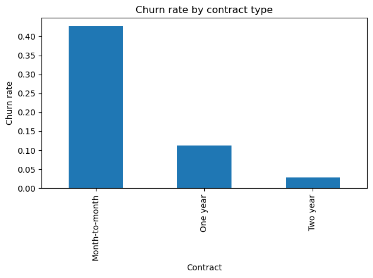
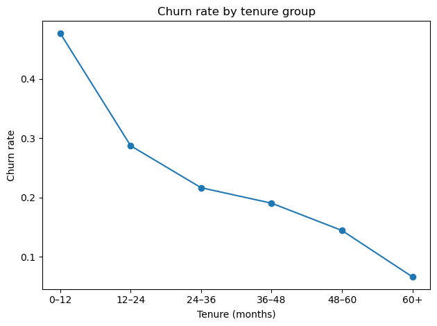
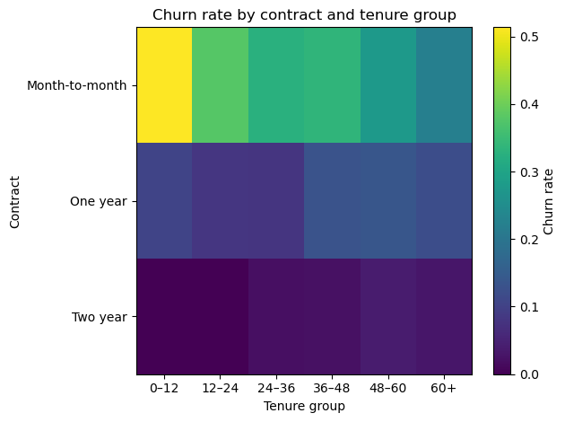

# Customer Churn & KPI Analysis

## Overview
This project analyses customer churn for a subscription-based business to identify key drivers of customer attrition and inform retention strategy.
Using a combination of **SQL** and **Python**, the analysis focuses on churn rates, customer tenure, contract types, and their interaction.

The goal is to answer a simple business question:
**Who is churning, when do they churn, and why?**

---

## Dataset

The dataset used in this project is the **Telco Customer Churn** dataset, sourced from **Kaggle**. It represents a fictional but realistic telecommunications subscription business and is widely used for churn and retention analysis.

Each row corresponds to an individual customer and includes information on:
- customer demographics 
- subscribed services 
- contract details 
- customer tenure (months with the company)
- financial metrics
- churn outcome (whether the customer left the service)

Although the dataset is synthetic, it closely mirrors real-world subscription business data and is well suited for analysing customer churn, retention patterns, and contract-driven behaviour.

---

## Tools & Technologies
- **Python** (pandas, matplotlib)
- **SQL** (SQLite)
- **Jupyter Notebooks**
- **GitHub** for version control and presentation

---

## Analysis Workflow

### 1. Data validation & cleaning
- Loaded raw CSV data and validated structure and data types
- Identified non-numeric values in `TotalCharges`
- Converted values safely and removed a small number of invalid rows
- Documented all cleaning decisions

### 2. KPI analysis (Python)
- Calculated overall churn rate
- Analysed churn by:
  - contract type
  - customer tenure
  - contract × tenure interaction
- Translated results into business insights

### 3. SQL validation
- Loaded cleaned data into a SQLite database
- Reproduced all KPIs using SQL
- Confirmed SQL results matched Python analysis

---

## Key Insights

### 1. Churn is heavily front-loaded
Nearly half of all churn occurs within the first 12 months of a customer’s lifecycle. Churn declines steadily as tenure increases.

### 2. Contract type is a major churn driver
Month-to-month customers churn at significantly higher rates than customers on one-year or two-year contracts.

### 3. Early-tenure, month-to-month customers are the highest-risk segment
Customers on month-to-month contracts in their first year represent the single largest churn risk, with churn rates exceeding 50%.

---

## Key Visuals

### Churn by contract type

### Churn by tenure group

### Churn heatmap: contract × tenure

---

## Business Recommendations
- Focus retention efforts on **new customers**, particularly in the first 12 months
- Encourage early migration from month-to-month contracts to longer-term plans
- Prioritise onboarding and early-life customer experience improvements
